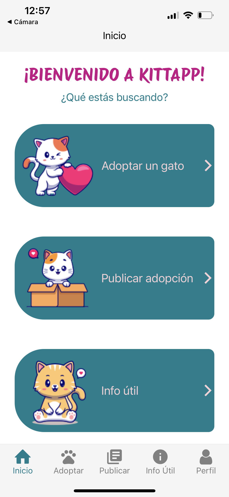

# KITTAPP - Adopción de gatos

### Proyecto final del curso de Desarrollo de Aplicaciones de Coderhouse desarrollada con React Native.

## Librerias utilizadas:

- React
- Redux
- React Native Navigation
- Firebase
- Yup
- RTK Query
- Expo Picker Image:

## Para clonar el repositorio:

1. Clona el repositorio en tu dispositivo: `git clone https://github.com/solprinz/kitt-app-react.git`
2. Instala las dependencias: `npm install`
3. Ejecuta la aplicación: `npm start`
